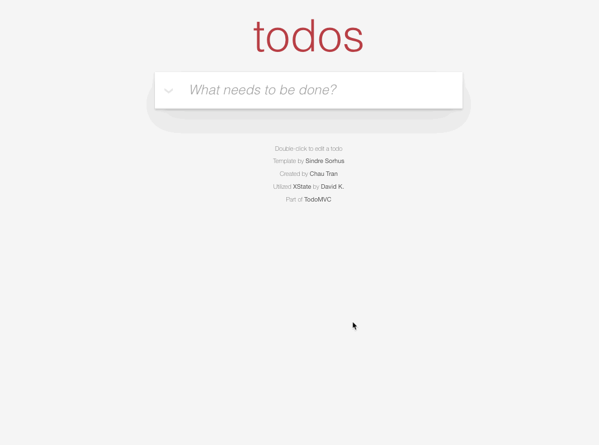
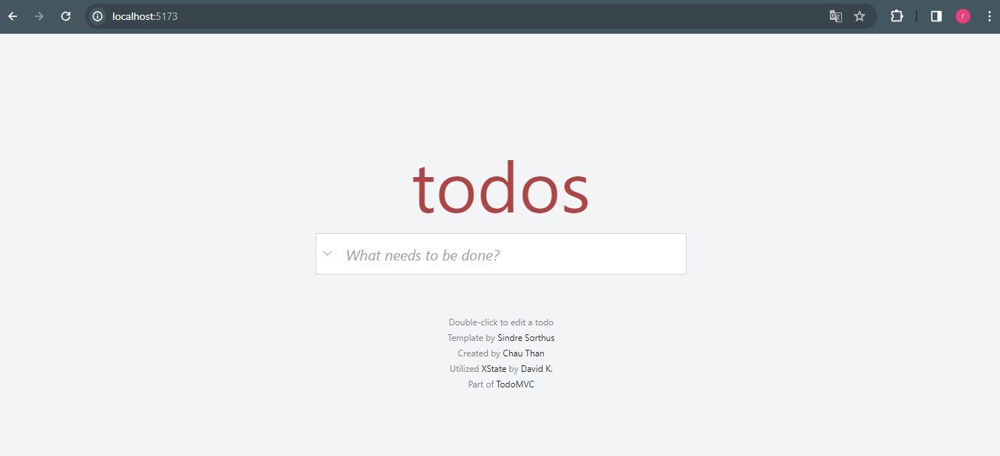
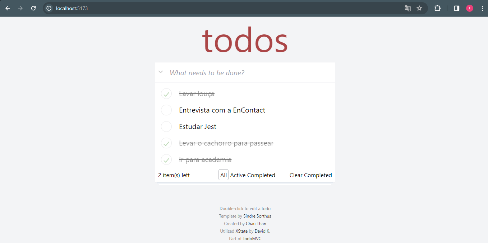
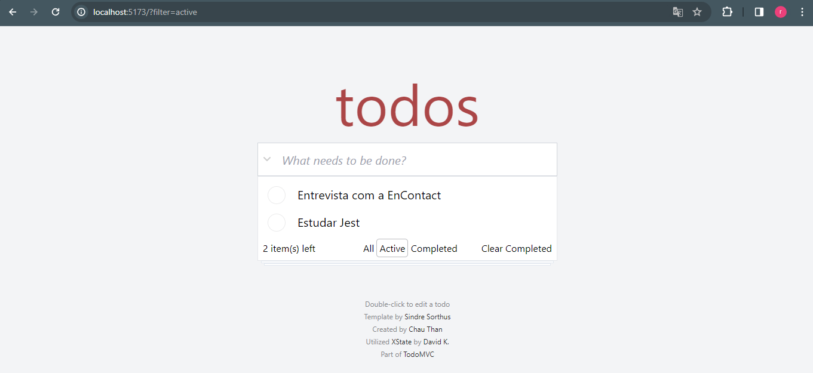
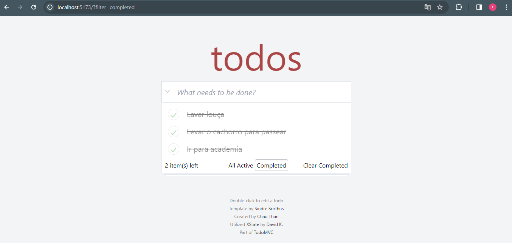
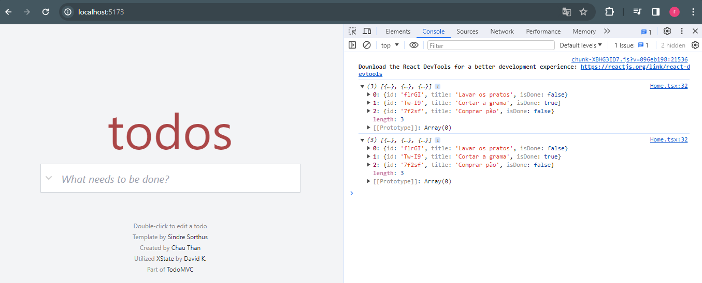

# Teste front-end enContact

Teste para desenvolvimento front-end na enContact.

## O teste

Testando suas habilidades em TypeScript e folhas de estilos, nos baseamos no projeto [Todo MVC](https://todomvc.com).

  

Neste teste você poderá mostrar suas habilidades em gerência de estados, listas utilizando `map`, `filter`, `find`, `reduce`, API, css, entre outros.

O foco deste teste é a implementação de uma lista de tarefas, onde você deve listar, criar, mudar o título, mudar o estado para concluído ou não, e remover uma tarefa, além das informações de quantas tarefas ainda estão pendentes, filtrar as ativas, completas, e poder limpar as tarefas completas (removendo da lista).

## O repositório

1. Faça o fork do nosso repositório no Github.
2. Clone do projeto.
3. Instale as dependências do projeto (utilizando o `yarn` ou `npm install`).
4. No arquivo `src/app.tsx` você irá encontrar o esqueleto dessa aplicação, este é seu ponto de partida.
5. Utilize `yarn start` ou `npm start` para inicializar a aplicação.

## O que fazer?

1. Recupere as tarefas iniciais via GET da URL [https://my-json-server.typicode.com/EnkiGroup/DesafioReactFrontendJunior2024/todos](https://my-json-server.typicode.com/EnkiGroup/DesafioReactFrontendJunior2024/todos) - Mesmo conteúdo do arquivo `db.json` do repositório.
2. No [projeto Todo MVC](https://todomvc.com) é disponibilizada uma interface estilizada de lista de tarefas. Para testar suas habilidades com estilos, gostaríamos que você repita exatamente o mesmo estilo da imagem abaixo.
3. Adicione uma tarefa na lista;
   - Para adicionar, escrever o título da tarefa e pressionar Enter para registrar.
   - Apresentar a tarefa criada no início da lista.
   - A tarefa deve ser marcada como "não concluída" ao ser registrada.
4. Liste as tarefas.
5. Posso marcar ou desmarcar uma tarefa como concluída.
6. Ao passar o mouse em cima de uma tarefa podemos ver um ícone de remoção, ao clicar deve-se remover a tarefa.
7. Ao clicar duas vezes em um item, deve apresentar o modo de edição de uma tarefa.
8. Ao clicar na seta (ao lado do campo de criação de tarefas no protótipo), posso marcar todas as tarefas como concluídas.
9. Logo abaixo da lista temos algumas informações no protótipo;
   - Canto inferior esquerdo: quantidade de **itens restantes** (não marcados como concluído).
   - Canto inferior direito: botão para limpar (remover) os itens já concluídos com contador.
   - Filtros "Todos", "Ativos" e "Completos", ao clicar deve filtrar a lista e marcar o botão como ativo. (Obs.: Utilize a URL para os filtros `react-router-dom`).
     - Todos: Mostra ativos e completos.
     - Ativos: Mostra apenas os ativos.
     - Completos: Mostra apenas os completos.

  

## Desafio do desafio

Tem um tempinho a mais? Acha que pode fazer mais? Então aqui vai alguns desafios para seu projeto, que serve como um plus no seu teste!

- E se essa aplicação tiver testes?

 

 

# Teste front-end enContact

## Desenvolvedor 👨🏽‍💻

- <a target="_blank" href="https://www.linkedin.com/in/ramon-barreto-medrado/">Ramon Barreto</a>

## Utilizei o Vite para criar a aplicação React 
> Passos para rodar a aplicação:
- [x] Direcione o caminho do seu terminal até a pasta principal do projeto: <strong>Frontend</strong>
- [x] Instale as dependências com o comando <strong>'npm install'</strong>
- [x] Na pasta <strong>Frontend</strong> digite o comando <strong>'npm run dev'</strong> para dar o start na aplicação (renderizar)

  
### Preview inicial da aplicação 📖 

  

### Preview da tela com as tarefas criadas 📄✏

#### Filtro 'All' por dafault (padrão)
> Trazendo todas as tarefas criadas 📝

  

#### Selecionando o Filtro 'Active'
> Para trazer as tarefas que foram criadas, mas que ainda não foram concluídas/checadas 📝⏳

  

#### Selecionando o Filtro 'Completed'
> Para trazer as tarefas que já foram concluídas/checadas 📝✔

  

### Recuperando as tarefas iniciais via GET da URL através do Console 📨

  

## Testes 🧪
> Apenas instalei o Jest, irei continuar codando para implementar o teste de cada componente criado. (Testes em desnvolvimento 🏗)

## Tecnologias 🛠
- React
- Axios
- Git

## Meu Contato 📲

- Email: ramon_barreto_medrado@hotmail.com